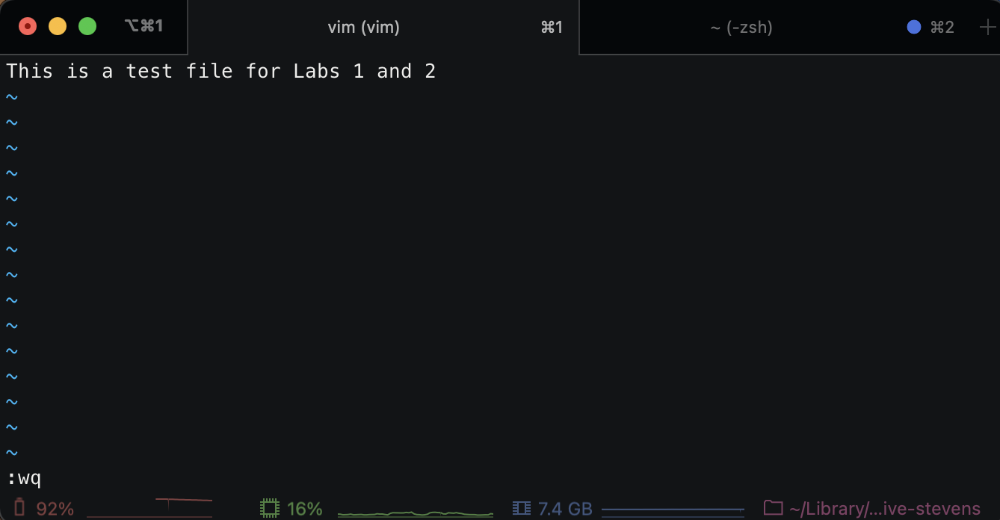
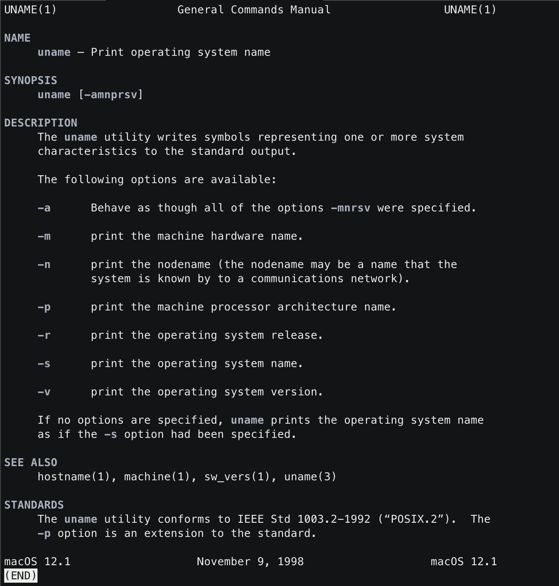
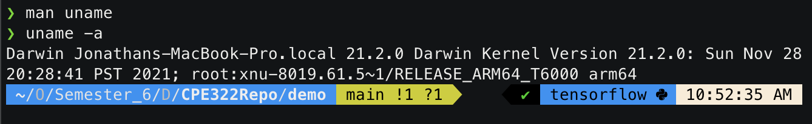
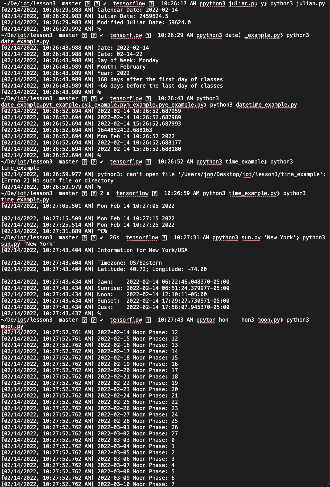
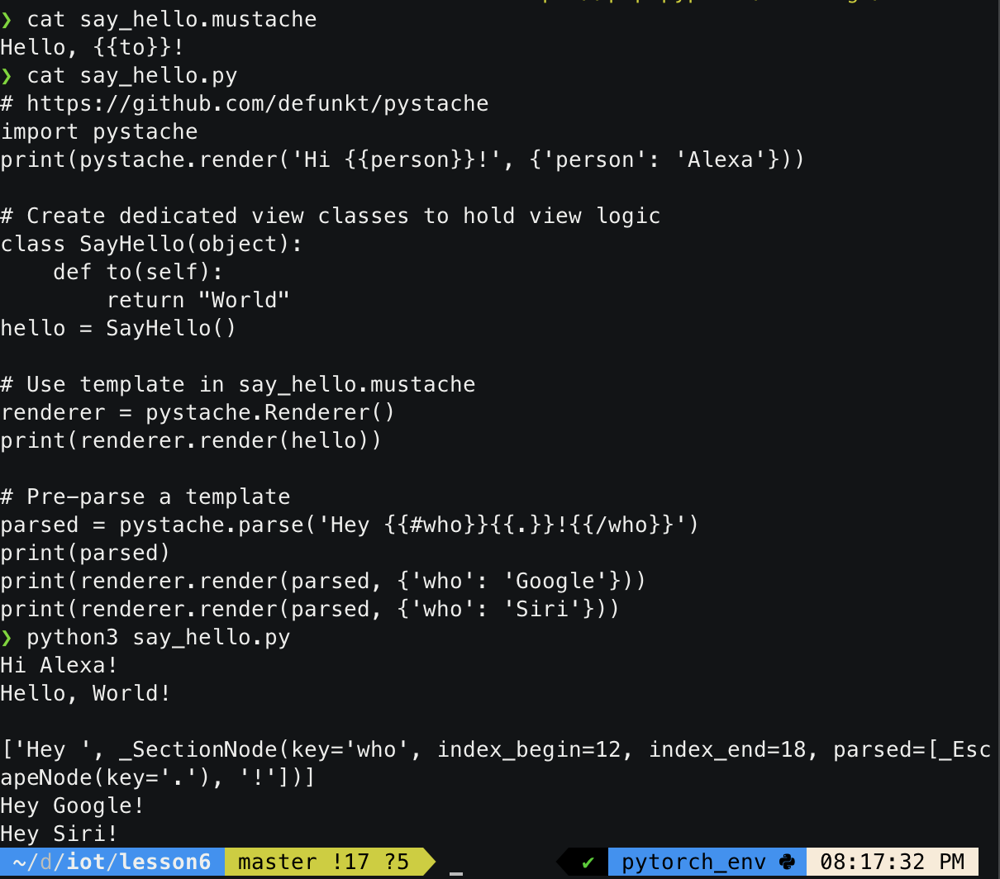
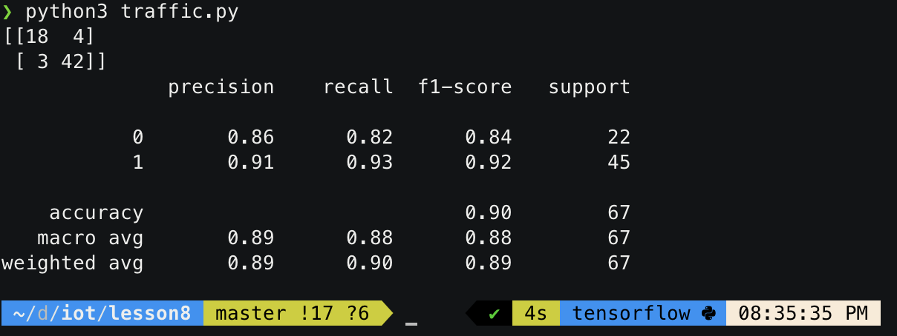

# CPE322Repo
### This is the repository that will be used for Engineering Design VI

#### Labs 1 and 2

#### Lab 3

#### Lab 4
#### Lab 5
#### Lab 6

#### Lab 7
#### Lab 8

#### Lab 9
#### Lab 10
